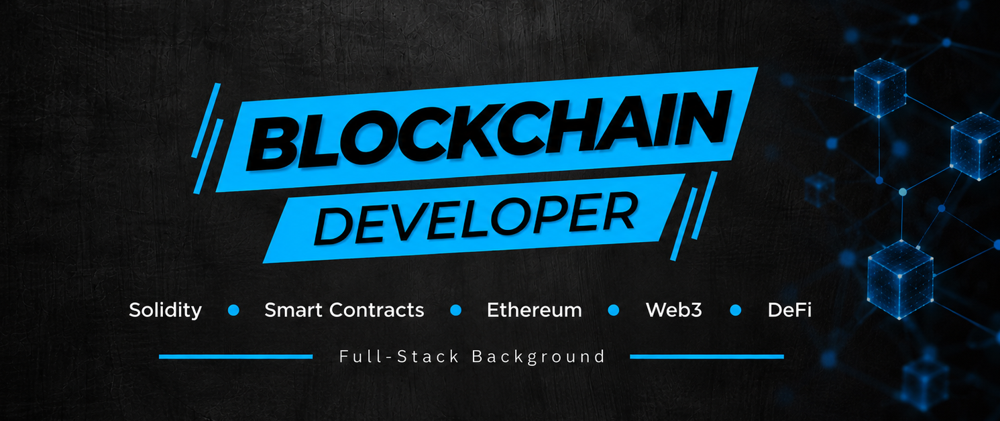

<!-- Esto es un comentario -->

<!-- 
# 
:warning: HEY YOU! :warning:

### 
My name is... :speaker: *Israel*

### 
They call me... :sound: *Isra*

### 
You can call me... :loud_sound: *Isra || Israel* :wink:
 
-->

# 
👋 Hi, I'm Israel! 
 
 

## :computer: Blockchain Developer

## About Me :boy:

I'm a developer who likes to build.

My current focus is **Blockchain Development**, with a particular interest in **Solidity, Smart Contracts, Ethereum, Web3 and DeFi**.

I'm currently expanding my knowledge through a hands-on approach, building projects that allow me to understand not only how to write Smart Contracts, but also how they interact with the EVM, wallets, transactions and blockchain networks.

My goal is to continue growing as a **Blockchain Developer** and contribute to the development of secure, efficient and useful decentralized applications and protocols.
 

## ⛓️ Blockchain & Web3

My current technical focus includes:

- Solidity
- Smart Contracts
- Ethereum & EVM
- ERC-20 and tokenization
- OpenZeppelin
- DeFi protocols
- DEXs & swaps
- Liquidity pools
- Lending & borrowing
- Yield farming
- Concentrated liquidity
- Off-chain signatures
- Gasless transactions
- Smart Contract Security
- Gas optimization
- Low-level Solidity & Assembly

I'm currently developing **25+ hands-on Blockchain projects** as part of my Blockchain development training, covering different aspects of Smart Contract and DeFi development.

## 💻 Full-Stack Background :hammer_and_wrench:

Before focusing on Blockchain Development, I built my professional background as a **Full-Stack Developer**, developing and maintaining web applications in production environments.

<!--
 
 
 
 

 
 
 
 
 
 
 
 
 
 
-->

- **Blockchain:** `Solidity` `Ethereum` `EVM` `OpenZeppelin` `Web3` `DeFi` `Smart Contracts`
- **Frontend:** `React` `TypeScript` `JavaScript` `HTML` `CSS` `Vue`
- **Backend:** `Python` `Django` `Node.js` `Express.js` `Java`
- **Databases:** `MySQL` `SQL` `MongoDB` `SQLite`
- **Version Control & Tools:** `Git` `GitHub` `Foundry``Remix` `Hardhat` `Foundry` `MetaMask`
  <!--
    
    
    
  
  -->
  
## My Projects

> **If you want to see all my projects go to the repositories section in [my GitHub profile](https://github.com/israelinxy?tab=repositories).**

## Contact Me  :email: 

 
 

###### Handmade by: **Israel** :black_nib:

---
